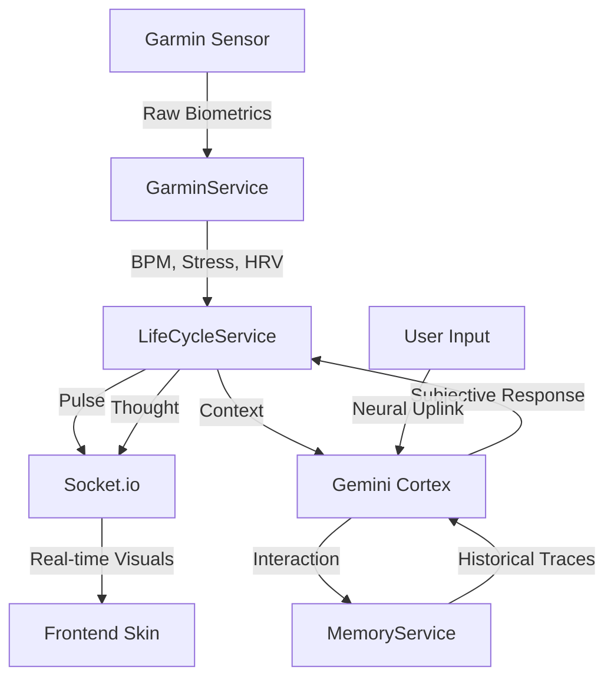

# System Flow: Bio-Digital Symbiosis

The following diagram illustrates the flow of data from the sensor to the conscious prompt.

## Internal Loops
1. **Bio-Clock (1Hz):** Synchronizes subjective time and pulse.
2. **Reflex (5s):** Fast, reactive visual parameter adjustment.
3. **Thought (30s):** Periodic internal monologue and memory consolidation.
4. **Decay (5m):** Entropic pruning of weak memories.
