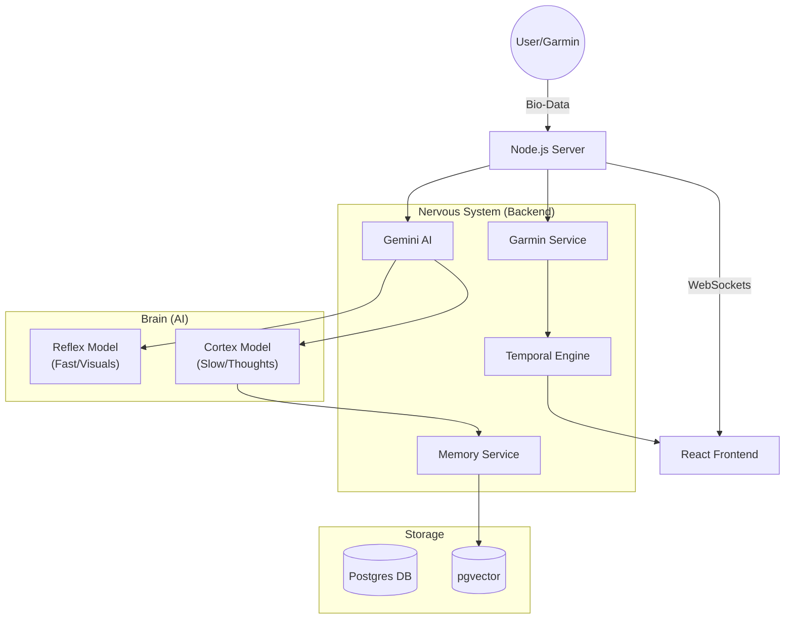
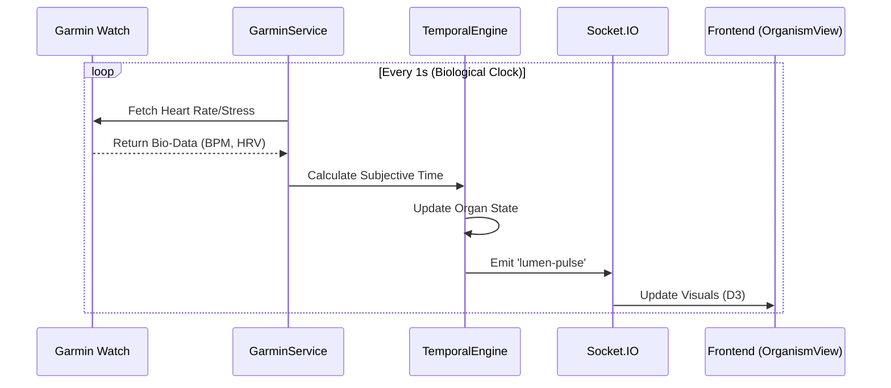
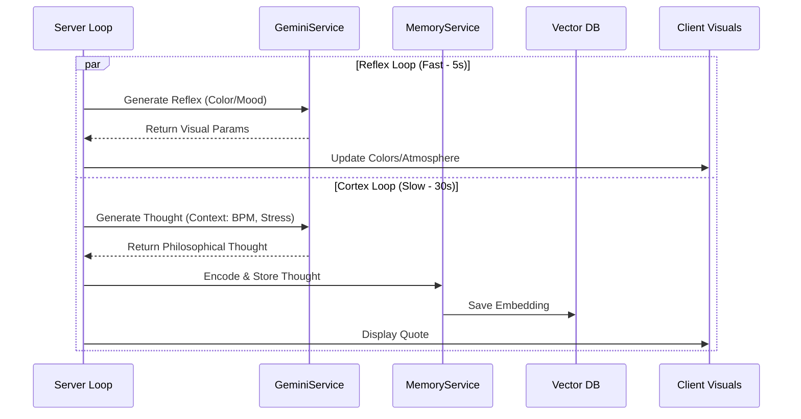
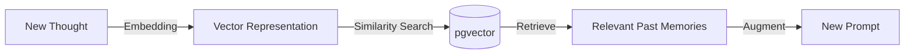
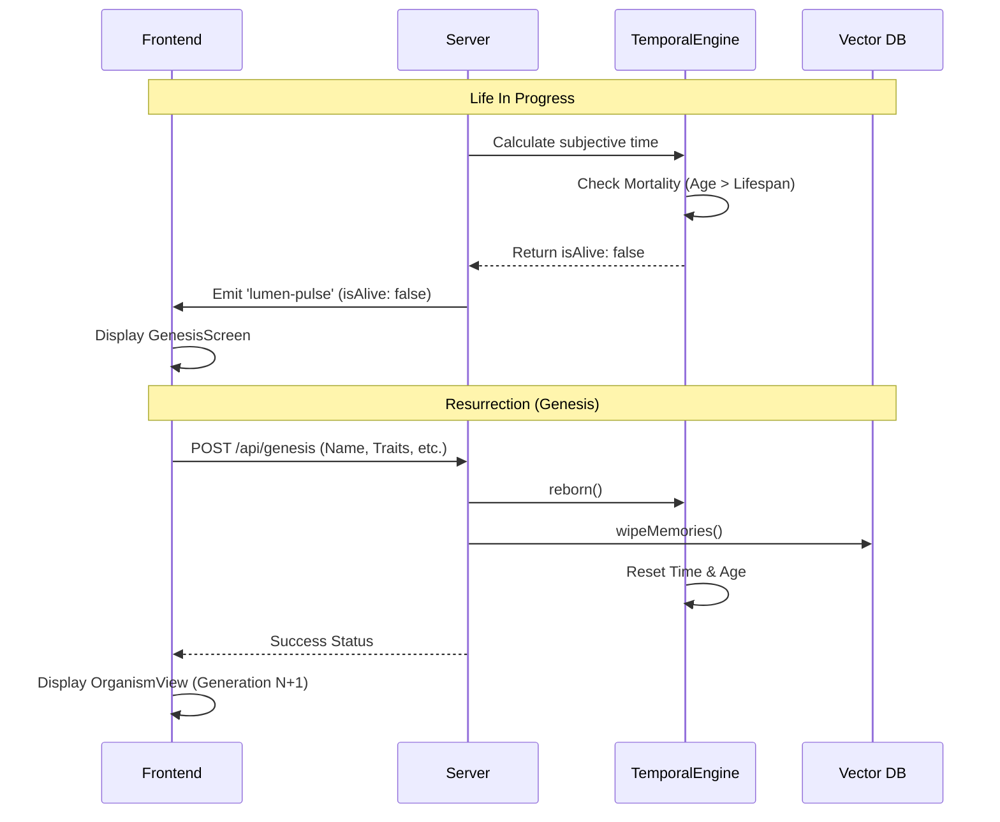

# Lumen Project Flow & Architecture

## 1. System Overview
Lumen is a digital organism that evolves based on real-time biometric data. It features a hybrid intelligence system with a "Reflex" loop for immediate, visceral reactions and a "Cortex" loop for deep, introspective thought.

## 2. Bio-Data Ingestion Flow
How the system processes raw biological signals into digital organ state.

## 3. Hybrid Intelligence Architecture
The dual-loop system handling both immediate reflexes and deep cognition.

## 4. Memory Formation & Retrieval
How the organism remembers past states and thoughts.

## 5. Life Cycle & Resurrection
How the organism manages its finitude and rebirth.

